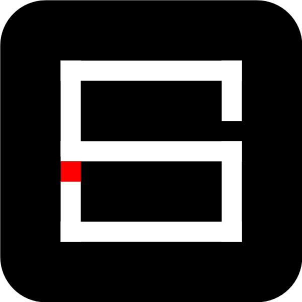
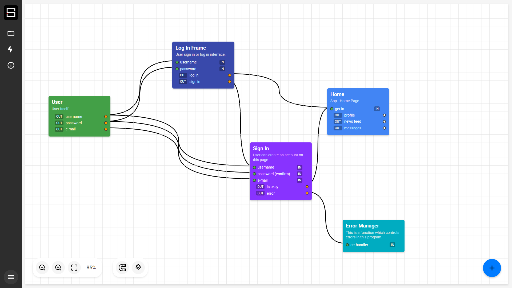

# SheGen

  

 

## Project Overview

Shegen is a visual programming interface designed to bridge the gap between natural language instructions and computational processes. It provides an intuitive visual environment for designing computational flows using SheLang, enabling users to create detailed instructional sequences for AI-driven systems.

This prototype version demonstrates the core functionality of the platform, allowing users to create, connect, and manipulate nodes in a visual programming environment with real-time preview capabilities.

  

## SheLang Framework

SheLang (Semantic Hierarchical Execution Language) is a domain-specific language designed for describing complex computational processes using a hierarchical structure. It allows for:

- Precise specification of computational workflows
- Hierarchical organization of tasks and subtasks
- Semantic representation of computational intent
- Integration with AI-driven execution environments

The Shegen interface provides a visual representation of SheLang, making it accessible to users without extensive programming knowledge.

## Technical Features

- **Interactive Canvas:** Drag and drop interface for creating node-based workflows
- **Magnetic Connections:** Smart port connections for intuitive node linking
- **Layer Management:** Organize complex workflows with layering capabilities
- **SheLang Export:** Generate SheLang code from visual representations
- **Responsive Design:** Works across various screen sizes and devices

© 2025 Shegen. All rights reserved. 
